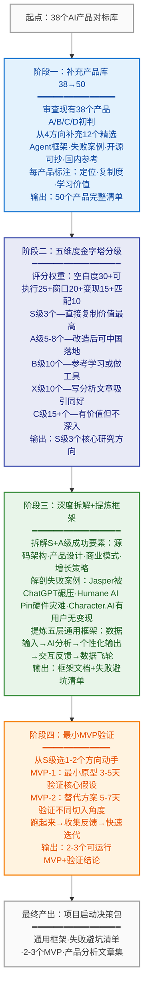

# AI产品研究 → 框架提炼 → MVP构建 全流程图

```mermaid
flowchart TB
    START["起点：38个AI产品对标库"]

    P1["阶段一：补充产品库 38→50
    ━━━━━━━━━━━━━━━
    审查现有38个产品A/B/C/D初判
    从4方向补充12个精选
    Agent框架·失败案例·开源可抄·国内参考
    每产品标注：定位·复制度·学习价值
    输出：50个产品完整清单"]

    P2["阶段二：五维度金字塔分级
    ━━━━━━━━━━━━━━━━━
    评分权重：空白度30+可执行25+窗口20+变现15+匹配10
    S级3个—直接复制价值最高
    A级5-8个—改造后可中国落地
    B级10个—参考学习或做工具
    X级10个—写分析文章吸引同好
    C级15+个—有价值但不深入
    输出：S级3个核心研究方向"]

    P3["阶段三：深度拆解+提炼框架
    ━━━━━━━━━━━━━━━━━
    拆解S+A级成功要素：源码架构·产品设计·商业模式·增长策略
    解剖失败案例：Jasper被ChatGPT碾压·Humane AI Pin硬件灾难·Character.AI有用户无变现
    提炼五层通用框架：数据输入→AI分析→个性化输出→交互反馈→数据飞轮
    输出：框架文档+失败避坑清单"]

    P4["阶段四：最小MVP验证
    ━━━━━━━━━━━━━
    从S级选1-2个方向动手
    MVP-1：最小原型 3-5天 验证核心假设
    MVP-2：替代方案 5-7天 验证不同切入角度
    跑起来→收集反馈→快速迭代
    输出：2-3个可运行MVP+验证结论"]

    END["最终产出：项目启动决策包
    ━━━━━━━━━━━━━━━━━
    通用框架·失败避坑清单·2-3个MVP·产品分析文章集"]

    START --> P1 --> P2 --> P3 --> P4 --> END

    style START fill:#fafafa,stroke:#9e9e9e,stroke-width:2px,color:#424242
    style P1 fill:#e3f2fd,stroke:#1976d2,stroke-width:2px,color:#0d47a1
    style P2 fill:#e8eaf6,stroke:#3949ab,stroke-width:2px,color:#1a237e
    style P3 fill:#e8f5e9,stroke:#388e3c,stroke-width:2px,color:#1b5e20
    style P4 fill:#fff3e0,stroke:#f57c00,stroke-width:2px,color:#e65100
    style END fill:#fafafa,stroke:#9e9e9e,stroke-width:2px,color:#424242
```
