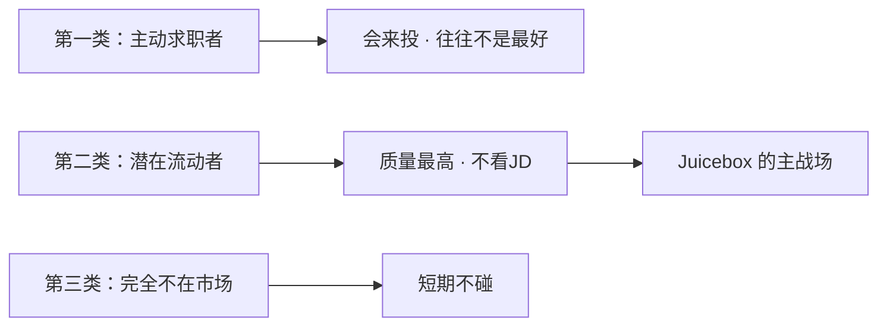

# 简历多了反而招不到人：一个19岁辍学生用4个人做到$10M年收入

*这是三湘问道第021篇。*
*006讲Yoodli：卖人的成长。*
*018讲11x：复制动作，不复制形态。*
*这一篇讲招聘：问题不是筛得不够快，是站错了边。*

---

## 先说结论

一个19岁辍学、22岁入伙的合伙人，4个人做到$10M年收入，红杉领投A轮，2026年3月B轮估值$8.5亿。（**A-claim**：BusinessWire 官方新闻稿；$1M→$10M 路径为 **B-investor**：YC 官网 + 红杉博客，存在立场偏差）

他们做的不是更好的简历筛选器。

他们发现了一件事：AI让求职者可以无成本海投，一个职位平均收到约250份申请已是常态（**B级**：行业报道与招聘方访谈汇总，非单一审计口径），其中大量是AI批量生成的投递。HR「等人来投」的漏斗，正在系统性失效。

他们的答案是**换边站**——在简历海出现之前，主动把人找到。

这篇拆Juicebox，但真正想说的是：**中国同样存在招聘链条里的信任问题，但解法完全不同。** 不能直接复制美国的「800M人才搜索」；更空的位置，是猎头协作网络里「候选人状态是否可信」那一层。

---

## 一、那个数字让他们看见了机会

Sarah，38岁，某AI创业公司的Head of Talent，团队3人，每季度要招20名工程师。

2024年以前，她的工作流很简单：LinkedIn发JD → 等简历 → 筛 → 约面。筛简历占她六成时间。

2025年变了：每个职位从80份申请涨到300份。其中约七成是格式标准、关键词匹配、但根本没认真看过JD的AI海投。她每周花20小时在简历里打捞，真正值得约面试的，不到5个。

她的卡点不是「找不到人」，是**「简历海里找不到那5个，却每天在垃圾里泡着」**。

Juicebox（前身PeopleGPT）给的不是更快的筛子，而是另一条路：用自然语言描述你要的人，15分钟拿到一批符合画像的候选人，加上可验证的邮件地址——**不用等他们来投**。

一句话定位：**不是招聘平台，是出站猎才引擎**（outbound recruiting：招聘方主动出击，而不是等人来投）。

关键数字串起来是这样：

| 节点 | 数字 | 证据 |
|------|------|------|
| 团队规模（早期） | 4人 → 35人（2026） | B级·公开报道 |
| 收入 | $1M ARR → $10M ARR | B-investor |
| A轮 | $36M，红杉领投（2025-09） | A-claim |
| B轮 | $80M，估值$8.5亿（2026-03） | A-claim |
| 客户 | 5,000家（B轮时） | A-claim |

---

## 二、反直觉洞察

通常大家以为：招聘的问题是「简历不够」，或者「筛选不够快」。

Juicebox的判断：**不是筛选问题，是方向问题。**

把符合岗位的候选人分成三类：

- **第一类，主动求职者**——天天刷平台，会看到JD，但往往不是你最想要的人。
- **第二类，潜在流动者**——有工作、不算不满意，有好机会愿意谈；质量最高，但**根本不会主动来投**。Juicebox要找的是这批人。
- **第三类，完全不在市场上**——短期触达价值低，先不碰。

关键洞察在这里：**简历是候选人写给HR看的营销材料。** Juicebox绕开这层，直接看候选人没有刻意展示的信息——GitHub提交记录、公开演讲、换工作频率、项目痕迹。用LLM做语义理解，而不是「简历里有没有React五年」这种关键词匹配。

创始人David Paffenholz的原话很直白：人才搜索还停留在2005年的Google关键词时代。入站失效之后，旧题的答案再快也救不了场。

**旧题**（所有竞争对手在答）：怎么从250份入站简历里筛出合适的人？
**新题**（Juicebox在答）：如果入站这条路已经废了，招聘方怎么在简历海出现之前主动找到人？

类比：Google没有和Yahoo目录比赛谁分类更细，而是换题——用户不想翻目录，他们想直接搜。Juicebox也没有和Greenhouse比谁筛简历更智能，而是换题——**招聘方不想在垃圾堆里提速，他们想在垃圾出现之前找到人。**

**失败对照：Gild（2012-2018）**。同样是AI招聘搜索，聚合GitHub、LinkedIn等公开数据。死因包括：算法偏见（推荐结果偏向特定人群）+ LinkedIn关系恶化 + 被收购后停运。Juicebox正在走同一条路——数据聚合越强，对LinkedIn的依赖越深，**同款风险就在不远处。**

---

## 三、它怎么做到的——机制拆解

两个关键机制，一层数据，一层增长。

### 机制一：数据层

- **800M+** 人才档案，聚合 **30+** 数据源（LinkedIn、GitHub、Twitter、学术网站、个人网站等）
- 用自然语言描述目标候选人，LLM推断语义——「做过PLG增长的SaaS产品经理」能匹配到简历里没写关键词、但轨迹对的人
- 输出：排序列表 + 摘要 + 验证过的联系邮件

类比：招聘界的 **Google搜索** vs 旧时代的 **Yahoo目录**。目录要你按分类翻；搜索要你描述问题，系统去找答案。

定价上，Growth档约 **$199/席位/月**（官网现读，**A-claim**，可能变化），约为LinkedIn Recruiter（$1,500-2,000/月）的十分之一。中端岗位请猎头太贵、发JD等入站太烂——这是Juicebox的真实战场。

### 机制二：增长飞轮

A轮前**没有正式销售团队**，增长靠创始人口碑：

> 红杉合伙人David Cahn转述：一个创始人用Juicebox招了整个20人团队，全程没用过外部猎头；后来发现红杉自己的内部Recruiter也在用。（**B-investor**）

飞轮路径：

1. 创始人用Juicebox招到好工程师  
2. 被招进来的人后来创业，自己也用  
3. LP网络、YC网络内互相推荐（Perplexity、Ramp等背书）  
4. 红杉内部Recruiter使用 → 红杉投资  

**产品必须在某一个场景真正做到「十倍好」，口碑才能自然流动。** 这是小团队唯一该学的增长打法——不是学800M档案怎么建。

### 已知弱点（不能不写）

**LinkedIn封号风险（B级）**：Reddit与多个专业博客记录，使用Juicebox Chrome插件后LinkedIn账号被暂停或封禁。对依赖LinkedIn生存的猎头/HR，这是生死攸关的风险。Juicebox营销材料几乎不提这一点——信息不对称。

此外还有：聚合数据过期需人工核实、主要只做邮件外发（不做InMail自动化）、ATS整合不完整。这些弱点说明：**它能帮你找到谁，但不能替你完成「愿不愿意谈」之后的整条链。**

---

## 四、猎头和Juicebox的真实差距

这是全文最反直觉的一处。

表面上，Juicebox数据远超猎头——800M vs 猎头个人几万人脉。但这个比较是错的：**两者解决不同层次的问题。**

| 维度 | Juicebox | 猎头 |
|------|----------|------|
| 候选人数量 | 800M，压倒性 | 几千到几万 |
| 信息类型 | 公开档案，静态历史 | 私人关系，动态意向 |
| 找到「合适的人」 | 强 | 强 |
| 找到「现在想动的人」 | 弱，只能从公开信号猜 | 强，关系里直接知道 |
| 触达成功率 | 冷邮件，有限 | 熟人接电话，高 |
| 单位成本 | 极低 | 极高 |

**Juicebox解决的是「找到谁」。猎头解决的是「这个人现在愿不愿意谈」。**

第二个信息不在任何公开数据库里。它存在于猎头和候选人的私人关系、微信往来、饭局里的半句话里。

更精确的定义：**Juicebox是候选人发现引擎，不是数字化猎头。** 猎头真正的价值，在Juicebox发出那封冷邮件、候选人点开之后，才刚刚开始。

所以不是「AI替代猎头」，而是：**发现层被工具化之后，关系层和意向层反而更值钱。**

---

## 五、中国有没有这个机会

直接否定：**不能把Juicebox原样搬来中国。**

原因不是「中国市场不够大」，而是**数据基础设施根本不同**：

- 无公开LinkedIn（领英职场已大幅缩减，2023年起关闭招聘功能）
- BOSS直聘、猎聘、智联是封闭平台，无公开API
- GitHub在中国开发者档案密度远低于北美
- 微信是主沟通渠道，不是邮件

中国白领岗位并不缺「简历」——2025年报告显示，全国平均每个职位约59次投递，部分岗位竞争指数达248（**B级**：社科院×智联招聘2025报告）。问题不是没人投，是**投来的大量不可信、协作时重复推荐、状态不透明**。

### 被忽视的结构：猎头协作平台为什么没规模化

猎必得、禾蛙、猎上网等拆单协作平台在中国已存在多年，商业逻辑验证过，却始终没能规模化。真实死法不是「没有需求」，而是一条螺旋：

**信息质量差 → 交易风险高 → 分佣争议多 → 优质猎头不愿共享好候选人 → 平台变重靠运营兜底 → 无法规模化**

有法院案例写明：猎头公司对候选人教育背景、任职经历、薪资等重要信息负有调查义务；「经手简历太多不可能一一核实」不能免责。（**B级**：裁判文书类公开信息）

### 真正空着的位置：候选人状态可信层

不是帮猎头找更多人，也不是再造一个800M数据库。

而是在**「候选人被推荐流转」的那一刻**，证明：

- 这个人是否真实  
- 是否还在看机会  
- 是否已被重复推荐给同一岗位  
- 授权与推荐归属是否清楚  

最小MVP可以极窄：**推荐前三项验证**——真实、仍活跃、未撞单。不需要平台合作，不需要全量库，贴近猎头现有工作流。

**商业结构锚点（B级）**：BOSS直聘2025年全年，企业端在线招聘收入约81.93亿元，面向求职者的增值服务仅约0.748亿元且同比下降（Kanzhun Limited 2025年报）。**招聘市场的钱在企业端，不在候选人端。** 按月订阅不是第一验证形态——价值发生在「关键候选人流通那一刻」，不是「每天打开」。

验证动作（给资源伙伴）：找10个猎头或HR，看他们是否愿意为单次「候选人状态验证」付费（¥10-30/次，或成单后抽佣0.5%-1%）。这比先做一个「中国版PeopleGPT」更接近真实付费点。

---

## 六、时间窗口

两个变量，给不同读者不同权重。

**变量一：LinkedIn反制（18-36个月）**

LinkedIn是Juicebox最大数据源，也是最强潜在对手。平台自身在升级AI搜索，有动机收紧第三方数据访问。一旦大规模封号或推出同类出站产品，Juicebox的数据护城河直接受损。这是**观察信号**，不是现在就否决——但跟投人应把它写进备忘录。

**变量二：中国候选人信任层窗口（24-36个月）**

猎聘、BOSS都在升级AI功能，但面向的是大企业HR的入站效率，不是猎头协作网络的**信任基础设施**。在下一轮平台洗牌前，用极窄的「状态验证卡」跑通交易型付费，窗口还在。

---

## 七、小团队能学什么

**建议学：Juicebox的增长打法**

不建销售团队，让产品本身成为推荐理由。前提是：你在某一个场景真正做到十倍好——创始人愿意用自己的产品招自己的团队，被招进来的人愿意继续传播。没有这个前提，口碑飞轮转不起来。

**不建议学：Juicebox的数据层**

800M档案是数年聚合、清洗、去重、联系方式验证堆出来的。小团队没有这个时间和资本。在中国还会撞上平台数据墙、微信触达合规、猎头不愿暴露好候选人的人性墙。

**中国可验证的最小动作**

找10个猎头或HR，验证他们是否愿意为「候选人状态验证」的单次服务付费。价值发生在流通那一刻，不是订阅仪表盘。

如果你正在思考AI和传统行业的结合，招聘链条里的**信任问题**——而不只是**搜索问题**——值得认真看。

---

## 结尾

**合伙人**：AI让买卖双方都在武装自己；美国这场军备赛里，Juicebox选了招聘方阵营。中国更值得看的是：交易网络已经存在，但信息不可信导致无法规模化——**状态可信层**比**全量搜索层**更接近可验证的切口。

**跟投人**（辅）：Juicebox B轮2026年3月披露，估值$8.5亿（**A-claim**）。LinkedIn风险是定价折扣项，不是缺席理由。中国机会仍在P0验证，本文不构成押注信号。

**资源伙伴**：如果你在猎头行业，或有招聘/HR场景的资源，欢迎来聊——我们在验证「候选人状态验证卡」有没有人愿意按次付钱。

---

**评论区问题：你认为猎头最终会被AI工具替代，还是因为AI工具而变得更值钱？**

---

*底稿来源：`cases/2026/深度底稿/Juicebox-拆解底稿.md` · 2026-05-21*
*证据等级：A-claim = 官方新闻稿/官网；B-investor = 投资方口径；B级 = 第三方报道/用户报告/行业报告*
