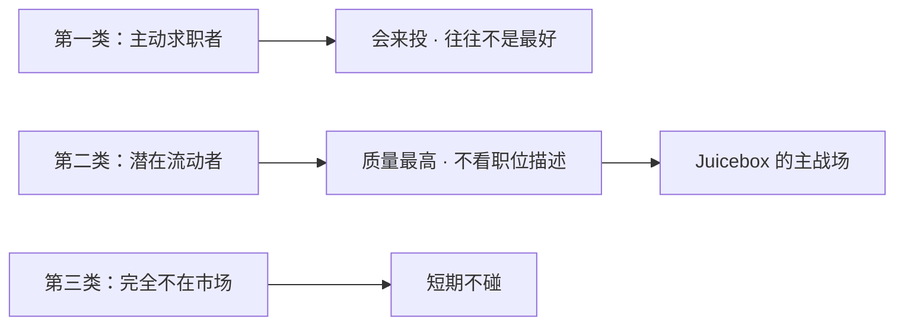

# 简历多了反而招不到人：一个19岁辍学生用4个人做到$10M年收入

*006讲Yoodli：卖人的成长。*
*017讲11x：销售员先承认「我自己找线索找不动」。*
*这一篇讲招聘：招聘负责人先承认「等人来投失效了」。*

---

## 先说结论

一位合伙人19岁辍学，22岁入伙。他们用4个人做到$10M年收入。红杉领投A轮。2026年3月，B轮估值达到$8.5亿。

融资信息来自BusinessWire官方新闻稿。$1M→$10M路径来自创业孵化器YC和红杉博客。前者标为**A-claim**，后者标为**B-investor**。投资方口径存在立场偏差。

他们做的不是更好的简历筛选器。

他们发现了一件事：AI让求职者可以无成本海投。一个职位平均收到约250份申请。其中大量投递由AI批量生成。

这组数据标为**B级**。它来自行业报道与招聘方访谈汇总，不是单一审计口径。

招聘方「等人来投」的漏斗，正在系统性失效。

他们的答案是**换边站**——在简历海出现之前，主动把人找到。

这篇拆Juicebox。但真正想说的是：**中国同样存在招聘链条里的信任问题。**只是解法完全不同。

不能直接复制美国的「800M人才搜索」。更空的位置在猎头协作网络里：**候选人状态是否可信。**

---

## 一、那个数字让他们看见了机会

红杉合伙人David Cahn讲过一个客户案例。

一位创始人用Juicebox招齐20人团队。全程没有使用外部猎头。后来，Cahn发现红杉内部招聘人员也在用。

这则案例来自红杉博客，标为**B-investor**。

Juicebox前身叫PeopleGPT。它给的不是更快的筛子。它给的是另一条路。

招聘方用自然语言描述要找的人。15分钟后，系统给出一批候选人画像。同时附上经过验证的邮件地址。

**不用等他们来投。**

一句话定位：**不是招聘平台，是出站猎才引擎。**

出站猎才，英文是outbound recruiting。它指招聘方主动找人。不再等人来投。

关键数字串起来是这样：

| 节点 | 数字 | 证据 |
|------|------|------|
| 团队规模（早期） | 4人 → 35人（2026） | B级·公开报道 |
| 年度经常性收入（ARR） | $1M → $10M | B-investor |
| A轮 | $36M，红杉领投（2025-09） | A-claim |
| B轮 | $80M，估值$8.5亿（2026-03） | A-claim |
| 客户 | 5,000家（B轮时） | A-claim |

---

## 二、反直觉洞察

通常大家以为，招聘的问题是「简历不够」。或者，是「筛选不够快」。

Juicebox的判断：**不是筛选问题，是方向问题。**

把符合岗位的候选人分成三类：

```mermaid
flowchart LR
  A["第一类：主动求职者"] --> A1["会来投 · 往往不是最好"]
  B["第二类：潜在流动者"] --> B1["质量最高 · 不看职位描述"]
  C["第三类：完全不在市场"] --> C1["短期不碰"]
  B1 --> J["Juicebox 的主战场"]
```

- **第一类，主动求职者**——天天刷平台，会看到职位描述。
  但他们往往不是你最想要的人。
- **第二类，潜在流动者**——有工作，也不算不满意。
  遇到好机会，他们愿意谈。
  这批人质量最高，却**根本不会主动来投**。
  Juicebox要找的就是他们。
- **第三类，完全不在市场上**——短期触达价值低，先不碰。

关键洞察在这里：**简历是候选人写给招聘方看的营销材料。**

Juicebox绕开这层。它直接看候选人没有刻意展示的信息。比如GitHub提交、公开演讲、换工作频率和项目痕迹。

它用大语言模型（LLM）做语义理解。不再只看「简历里有没有React五年」。

创始人David Paffenholz的原话很直白。他说，人才搜索还停留在2005年的Google关键词时代。

入站失效之后，旧题答得再快也救不了场。

**旧题**：怎么从250份入站简历里筛出合适的人？

**新题**：入站失效后，怎样主动找到合适的人？

Google没有和Yahoo目录比赛谁分类更细。它直接换了题。

用户不想翻目录，他们想直接搜索。

Juicebox也没有和Greenhouse比筛选速度。它同样换了题：
**招聘方不想在垃圾堆里提速。**
**他们想在垃圾出现之前找到人。**

**失败对照：Gild（2012-2018）。**

它同样做AI招聘搜索。它也聚合GitHub和LinkedIn等公开数据。

它出现过算法偏见。它与LinkedIn的关系也在恶化。被收购后，产品最终停运。

Juicebox正在走同一条路。数据聚合越强，对LinkedIn依赖越深。
**同款风险就在不远处。**

---

## 三、它怎么做到的——机制拆解

两个关键机制，一层数据，一层增长。

### 机制一：数据层

- **800M+** 人才档案，聚合 **30+** 数据源
  数据源包括LinkedIn、GitHub和Twitter，
  也包括学术网站和个人网站
- 用自然语言描述目标候选人，由大语言模型推断语义
- 即使简历没写关键词，也能匹配轨迹相符的人
- 输出：排序列表 + 摘要 + 验证过的联系邮件

类比一下：这是招聘界的 **Google搜索**。对面是旧时代的 **Yahoo目录**。

目录要求用户按分类翻找。搜索只要求用户描述问题。

Growth档约为 **$199/席位/月**。这是官网现读，标为**A-claim**，后续可能变化。

LinkedIn Recruiter是一款招聘工具。月费约为$1,500-2,000。前者大约是后者的十分之一。

中端岗位请猎头太贵，发布职位的效果又太差。这才是Juicebox的真实战场。

### 机制二：增长飞轮

A轮前**没有正式销售团队**。增长主要依靠创始人口碑。

开头那个20人团队案例，正好解释了它的口碑如何启动。

飞轮路径：

1. 创始人用Juicebox招到好工程师  
2. 被招进来的人后来创业，自己也用  
3. 红杉被投企业、YC创业公司互相推荐
   Perplexity、Ramp等公司提供背书
4. 红杉内部招聘人员使用 → 红杉投资

**产品必须在一个场景真正做到「十倍好」。**只有这样，口碑才能自然流动。

这是小团队应该学的增长打法。不该学的是如何堆出800M档案。

### 已知弱点（不能不写）

**LinkedIn封号风险（B级）**：
Reddit与多个专业博客记录过相关案例。
有用户安装Juicebox Chrome插件。随后，账号被LinkedIn暂停或封禁。

猎头和招聘人员高度依赖LinkedIn。因此，这是一项生存风险。

Juicebox营销材料几乎不提这一点。这里存在信息不对称。

此外，聚合数据过期后仍需人工核实。产品主要做邮件外发。它不自动发送LinkedIn站内信（InMail）。招聘流程管理系统（ATS）整合也不完整。

这些弱点说明：**它能帮你找到谁。** **但它不能完成后续整条链。**

---

## 四、猎头和Juicebox的真实差距

这是全文最反直觉的一处。

表面上，Juicebox数据远超猎头。一边是800M，一边是个人几万人脉。

但这个比较是错的。**两者解决的是不同层次的问题。**

| 维度 | Juicebox | 猎头 |
|------|----------|------|
| 候选人数量 | 800M，压倒性 | 几千到几万 |
| 信息类型 | 公开档案，静态历史 | 私人关系，动态意向 |
| 找到「合适的人」 | 强 | 强 |
| 找到「现在想动的人」 | 弱，只能从公开信号猜 | 强，关系里直接知道 |
| 触达成功率 | 冷邮件，有限 | 熟人接电话，高 |
| 单位成本 | 极低 | 极高 |

**Juicebox解决的是「找到谁」。**
**猎头解决的是「这个人愿不愿意谈」。**

第二个信息不在任何公开数据库里。它藏在猎头与候选人的私人关系里。也藏在微信往来和饭局的半句话里。

更精确的定义是：**Juicebox是候选人发现引擎。** **它不是数字化猎头。**

Juicebox发出冷邮件后，猎头真正的价值才刚刚开始。

所以，这不是「AI替代猎头」。**发现层被工具化之后，关系层和意向层反而更值钱。**

---

## 五、中国有没有这个机会

直接否定：**不能把Juicebox原样搬来中国。**

原因不是「中国市场不够大」。而是**数据基础设施根本不同**：

- 领英职场已大幅缩减
  2023年起关闭招聘功能
- BOSS直聘、猎聘、智联是封闭平台，无公开API
- GitHub在中国开发者档案密度远低于北美
- 微信是主沟通渠道，不是邮件

中国白领岗位并不缺「简历」。

2025年报告显示，全国平均每个职位约有59次投递。部分岗位的竞争指数达到248。

数据来自社科院与智联招聘2025报告，标为**B级**。

问题不是没人投。而是**信息不可信、重复推荐、状态不透明**。

### 被忽视的结构：猎头协作平台为什么没规模化

猎必得、禾蛙、猎上网等协作平台，已经在中国存在多年。

商业逻辑有人尝试，却始终没有实现规模化。

真实死法不是「没有需求」。而是下面这条螺旋：

**信息质量差**

↓

**交易风险高**

↓

**分佣争议多**

↓

**优质猎头不愿共享好候选人**

↓

**平台依赖运营兜底**

↓

**最终无法规模化**

有法院案例写明，猎头公司对候选人重要信息负有调查义务。这些信息包括教育背景、任职经历和薪资。

「经手简历太多，无法逐一核实」，不能成为免责理由。

该项来自公开裁判文书，标为**B级**。

### 真正空着的位置：候选人状态可信层

不是帮猎头找更多人，也不是再造一个800M数据库。

真正的切口在候选人被推荐流转的那一刻。它需要证明：

- 这个人是否真实  
- 是否还在看机会  
- 是否已被重复推荐给同一岗位  
- 授权与推荐归属是否清楚  

最小可行版本（MVP）可以极窄。

先验证三项：真实、仍活跃、未撞单。它不需要平台合作，也不需要建立全量数据库。它贴近猎头现有工作流。

**商业结构锚点（B级）**：

2025年，BOSS直聘的企业端在线招聘收入约81.93亿元。求职者增值服务收入仅约0.748亿元，而且同比下降。

数据来自Kanzhun Limited 2025年报。

**招聘市场的钱在企业端。** **它不在候选人端。**

按月订阅未必是第一验证形态。价值发生在关键候选人流通的时刻。它不发生在用户每天打开产品的时刻。

这里有一个待验证命题：

猎头或招聘人员是否愿意为单次状态验证付费？
假设价格是¥10-30/次，或者成单后抽佣0.5%-1%。

这仍是假设，不是正在执行的项目。但它比先做一个中国版PeopleGPT，更接近真实付费点。

---

## 六、时间窗口

两个变量，给不同读者不同权重。

**变量一：LinkedIn反制（18-36个月）**

LinkedIn是Juicebox最大数据源。它也是最强的潜在对手。

平台正在升级AI搜索，也有动机收紧第三方数据访问。

一旦出现大规模封号，护城河就会受损。LinkedIn推出同类产品，也会产生同样影响。

这是**观察信号**，不是立即否决的理由。但跟投人应把它写进备忘录。

**变量二：中国候选人信任层窗口（24-36个月）**

猎聘和BOSS都在升级AI功能。它们瞄准大企业招聘部门的入站效率。并不瞄准猎头协作网络的**信任基础设施**。

下一轮平台洗牌前，窗口仍然存在。但「状态验证卡」能否收费，仍待验证。

---

## 七、小团队能学什么

**建议学：Juicebox的增长打法**

不建销售团队，让产品本身成为推荐理由。

前提是你在一个场景真正做到十倍好。创始人愿意用产品招聘自己的团队。被招进来的人也愿意继续传播。

没有这个前提，口碑飞轮转不起来。

**不建议学：Juicebox的数据层**

800M档案需要多年聚合、清洗和去重。联系方式也要持续验证。

小团队没有这样的时间和资本。

在中国，它还会撞上三堵墙。第一堵是平台数据。第二堵是微信触达合规。第三堵是猎头不愿暴露好候选人。

**中国可验证的最小动作**

最小的验证，是先找10个猎头或招聘人员访谈。问题只有一个：他们是否愿意为单次状态验证付费？

价值发生在流通那一刻，而不是订阅仪表盘。

如果你正在思考AI和传统行业的结合，先看**信任问题**。不要只看**搜索问题**。

---

## 结尾

**合伙人**：AI让买卖双方都在武装自己。美国这场军备赛里，Juicebox选择了招聘方。

中国更值得看的是另一层。交易网络已经存在，但信息不可信让它无法规模化。

**状态可信层**比**全量搜索层**，更接近一个可验证的切口。

**跟投人**（辅）：Juicebox B轮于2026年3月披露。估值为$8.5亿，标为**A-claim**。

LinkedIn风险是一项定价折扣，不是缺席理由。

中国机会仍停留在最早期假设（P0）。本文不构成押注信号。

**行业校验**：如果你在猎头或招聘一线，请告诉我这个判断哪里错了。候选人状态不可信，是不是协作平台最难跨过的一关？

---

**评论区问题：候选人状态不可信，是不是猎头协作最难跨过的一关？**

*下一篇拆Anthropic。*
*它为什么能在OpenAI的阴影下成功？*

---

*底稿来源：`cases/2026/深度底稿/Juicebox-拆解底稿.md` · 2026-05-21*
*证据等级：A-claim = 官方新闻稿/官网；B-investor = 投资方口径；B级 = 第三方报道/用户报告/行业报告*
