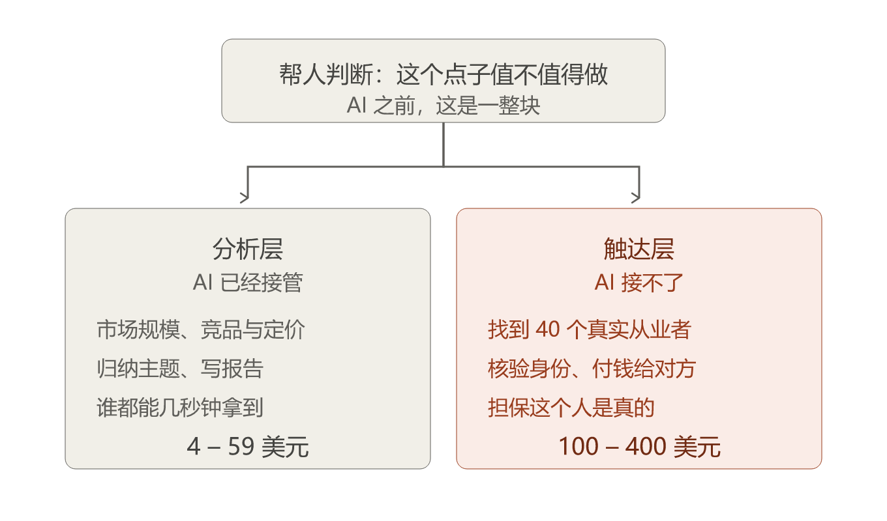
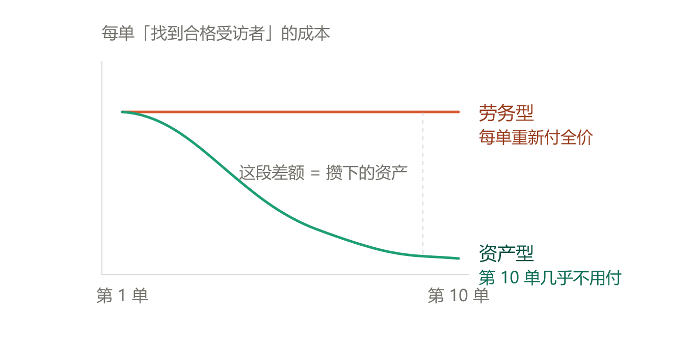
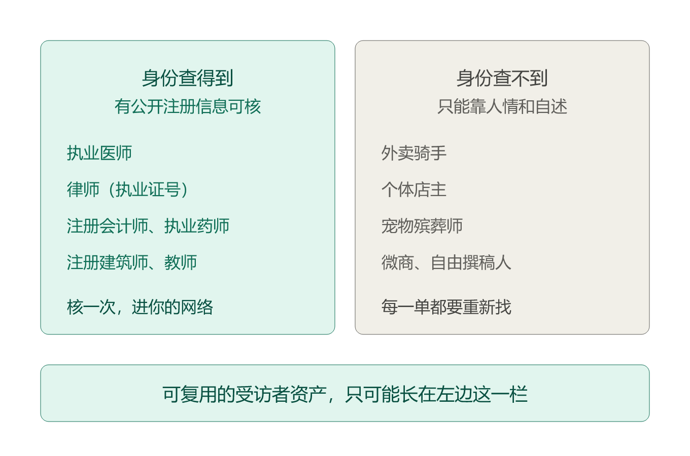

# 同一件事，AI 报价 4 美元，他报价 400 美元

> 编号：028 ｜ 类型：A（产品拆解）｜ 成稿日期：2026-08-18
> 数据时点：2026-08-18（Fiverr 页面与 kosmoresearch.com 快照）

有一批 AI 工具，专门帮你判断商业点子值不值得做。标价 4 到 59 美元，大多带免费档。

同一件事，一个英国人在 Fiverr 上卖 150 美元起。买家实际付了 100 到 400 美元。

你大概会以为，贵的那个分析更深、报告更厚。

但我翻完他那 33 条评价，没有一条在夸报告。客户夸的是另一件事：**我的人群很窄，他几天内给我找到了 40 多个真实的从业者。**

这 396 美元的差价，不在分析里。

图上这一刀，就是这篇文章的全部内容。剩下的，是它成立需要的条件，和它在中国会断在哪里。

---

## 一、先确认这两边卖的是同一件事

AI 工具那边：输入想法，输出市场规模、竞品、可行性评分。几秒钟。这批产品没有一家公开过付费用户数，只公开了价格。

英国人这边，账号名叫 Kosmo Research。交付内容是：市场规模、竞品与定价、**与真实潜在用户的问卷和访谈**、支付意愿测试、先做什么、改什么、砍掉什么。

两边的任务描述，差别只在加粗那一行。

再看交易痕迹。账号完成 336 单，204 条评价，4.9 分。这个具体服务 33 条评价，5.0 分。五条可见评价的实付分别落在 100—200 和 200—400，实际工期 3 到 11 天。其中三条标着"持续合作"——同一个买家回来下了第二单。

一边只有挂牌价，一边有 33 笔已完成交易和复购痕迹。

---

## 二、脏活归属判据

图 1 只回答了"劈在哪"。真正能带走的是**怎么找到你自己那一刀**。三问：

**第一问：这门生意里最脏、最慢、最没人愿意干的那段活是什么？**

答案必须是一个动作，不能是一种能力。"我们的专业判断力"不算。"我要一个个打电话找到 20 个执业药师"才算。

**第二问：这段活随客户数线性增长，还是能沉淀？**

图上那条平线，是你每单重新付全价。那条往下走的线，是第 1 单的支出让第 10 单变便宜。中间的差额，就是资产。

**第三问：让它能沉淀的那层基础设施，在你的市场存在吗？**

这一问最容易跳过。多数人以为第二问的答案取决于自己够不够勤快。其实取决于脚下有没有路。

---

## 三、跑给你看

**第一问的答案**：不是写报告，是找到 40 个符合条件的真实从业者并让他们开口。证据在评价里——客户夸的是"几天内拿到 40 多个符合条件的受访者"，"挖出用户真正在意的主题"。没有一条夸格式。

**第二问的答案**，藏在一个同名网站的价目表里。

先说清楚：网上有个叫 kosmoresearch.com 的自助研究平台，名字一样、做的事一样、面向人群一样。但**我没有找到任何一条公开证据，能把 Fiverr 上那个卖家和这个网站连起来。** 这是推断，不是事实。

不过接下来这件事，就算是两个人，结论一样成立——因为它反映的是市场对这两种东西的定价：

- 你自己跑：**99 欧**。含 AI 访谈、AI 问卷、语音转录、自动归纳。
- 我们帮你跑全套：**399 欧起**。含研究设计、招募受访者、主持访谈、出报告。

AI 的分析能力，全在便宜那一档里。**多付的 300 欧买的是招募、主持和责任。**

那这段活能不能沉淀？那个网站的招募页写得很直白：受访者按公开职业档案逐个核验真名、职位、公司；每季度重新校准；客户只为通过筛选的人付费。

最关键的是这句：**"面板按需求单增长。我们现在做的大部分垂类，在成为垂类之前，都是某个客户的一句'你能不能做 X'。"**

翻译：客户 A 要营养师，我花成本找到 40 个核验过的营养师。客户 B 也要营养师时，我不用从零再来。

**每一单的招募支出，同时是一次资产建设支出。**

这就是图 2 里那条往下走的线。

---

## 四、第三问落到中国，答案要改一半

前两问，中国创业者照抄没有障碍。第三问有。

Kosmo 脚下有一层免费、公开、可核的职业身份档案。核验一次，这个人就进了他的网络。中国没有这一层的**统一入口**。

我一开始判成"中国没有对应的东西，路走不通"。后来发现这个判断写宽了。

**中国缺的不是替代品，缺的是统一入口。可核的职业凭证在中国是按行业分散存在的。**

这张图不是在说"左边这些行业有机会"。它只回答一件事：**你那段最脏的活，有没有可能变成图 2 里往下走的那条线。**

在右栏，你不是在做网络型生意，是在做劳务型生意。一单赚一单，没有复利。这不是不能做，是要知道自己在做哪一门。

**必须挂一条反面。** 身份可查，不等于人可触达。你能查到某人是执业药师，不代表你能找到他、请动他、给他付钱。这是两笔账。**第二笔账我目前一格数据都没有，谁也别假装有。**

**关于时间变量。** 未来三五年有两个变量会动它：AI 语音访谈继续压低"主持"的成本；中国也可能出现某种跨平台的职业凭证互认。但它们更可能改写形态，而不是消灭机会。旧位置是"人肉攒一份名单"，新位置可能是"在某个凭证可查的行业里，把核验做成一次性动作"。

---

## 五、你今晚可以做的五分钟动作

打开备忘录，写下你自己那门生意的第一问答案。

规则只有一条：**必须是动作，不许写能力。**

写"我们的核心是十年行业经验"，不算。写"我要在两天内约到 5 个县级医院的采购科长"，算。

写完对着图 2 看第二问：这个动作，你做第 10 遍时会比第 1 遍便宜吗？

答案是不会，也别急着难过。它只说明你现在赚的是劳务的钱。想换赛道，得先找到那层能让核验沉淀的基础设施——而不是更努力地重复第 1 遍。

我们拆诊断空白那几个市场时踩过同一个坑（011）：**当时以为难点是判断准不准，后来才发现难点一直是够不够得着真人。**

---

## 最后

4 美元那批工具卖的是分析。分析这件事，AI 已经做得又快又便宜，而且还会更便宜。

400 美元那一单卖的是"我替你接触了 40 个你接触不到的人"。这件事 AI 现在做不了——它没有钱包，不认识人，也不能替你担保对方是真的。

所以更准确的说法可能不是"AI 会不会杀死这门生意"。

**AI 把它劈成了两半。便宜的那半更便宜了，贵的那半反而更稳。**

**下一篇**：我手上有一个反例——同样是"帮人做判断"，同样有真人参与，但它在中国的公开可核付款记录，到目前为止是零。我会把这个空白摊开讲，包括我为什么找不到，以及"找不到"和"不存在"差在哪里。

**评论区**：用第一问跑一下你自己的工作——你那一单里最脏、最慢的那段活是什么？我最想听具体动作，不是岗位名称。

---

## 发布备注（不进正文）

1. 三张结构图发布时贴 PNG，不贴 SVG；仓库 MD 版保留 PNG 引用。
2. 本文数据时点为 2026-08-18，若延后一个月以上发布，需重新核对 Fiverr 评价数与 kosmoresearch.com 价目表。
3. 「Fiverr 卖家与 kosmoresearch.com 是同一主体」为推断，未找到公开证据；正文已按推断处理，不得将两者合为事实引用。
4. 引用前文：正文显式引用 011 一处，未达底线 8（≥2 处）；发布前由杨决定补引或按 025 先例诚实记一笔。